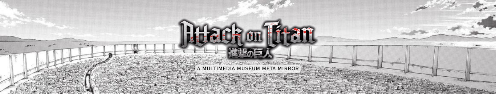

<h1 align='center'> ⚔️ Attack on MMMM ⚔️ </h1>

Welcome to _Attack-on-MMMM_, the final project for the course of **Information Modeling and Web Technologies** taught by professor Fabio Vitali at University of Bologna.

Our website is meant to be a **digital companion** for a museum about Hajime Isayama's work _Attack on Titan_. You can explore both the narration of the story and a collection that of real-world items that we curated to be representative, in part, of significant objects or figures or events found in _Attack on Titan_. 

We hope to pique your interest about the world of this literary and mediatic work and to spark your mind to reflect and find even more connections to add starting from our project. 

## Links 

If you want to know more fan-based or canon information about the work you can explore this wiki which we also used as inspiration: [_Attack on Titan Wiki_](https://attackontitan.fandom.com/wiki/Attack_on_Titan_Wiki). 

Here is also the link to the website of the physical museum dedicated to the artwork and its mangaka (author and artist) in Hita, Oita prefecture: [_Attack on Hita_](https://shingeki-hita.com/index.html).

## Learn more about the contributors

* 🌊 [Martina Marchesi](https://github.com/martinamrc)
* ✨ [Cristina Vercelli](https://github.com/cristinavercelli)
